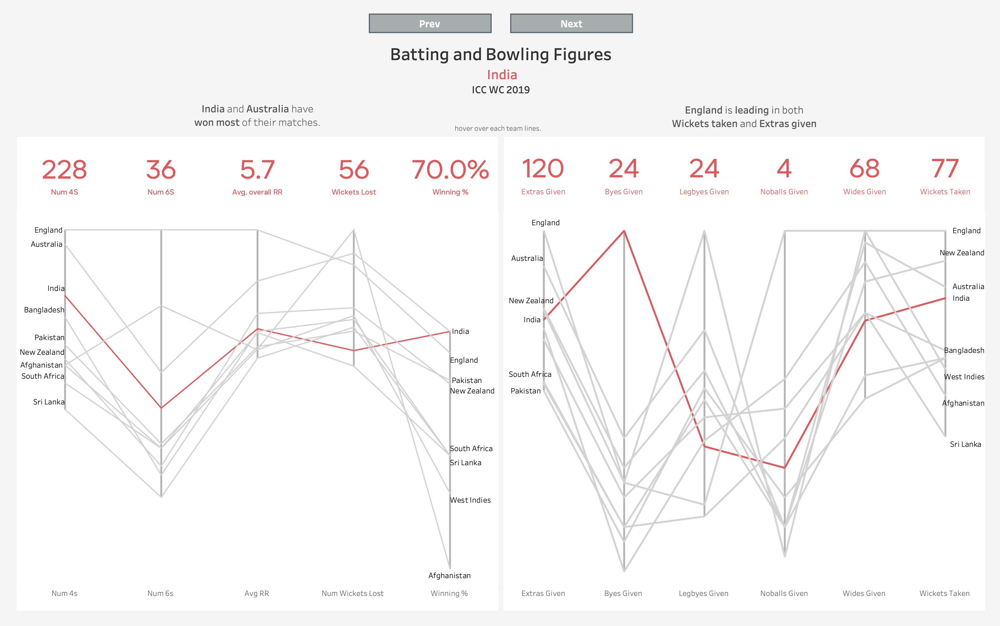
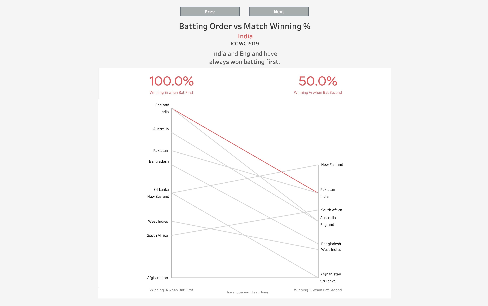
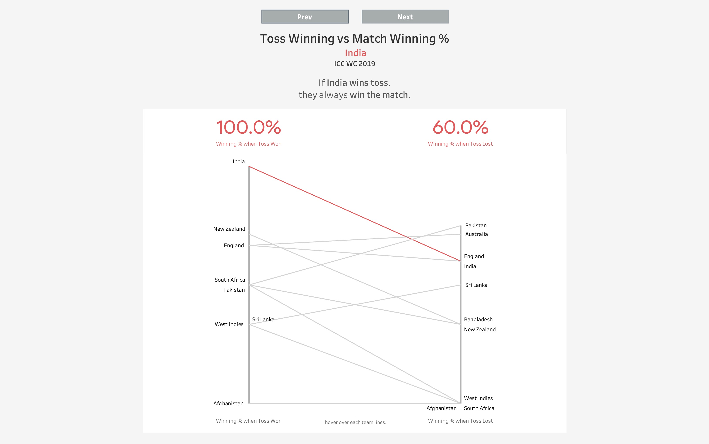
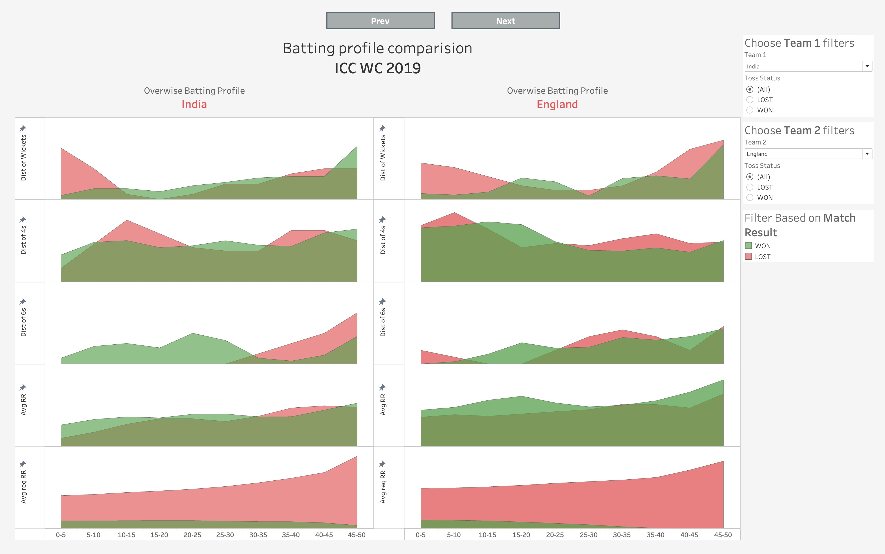
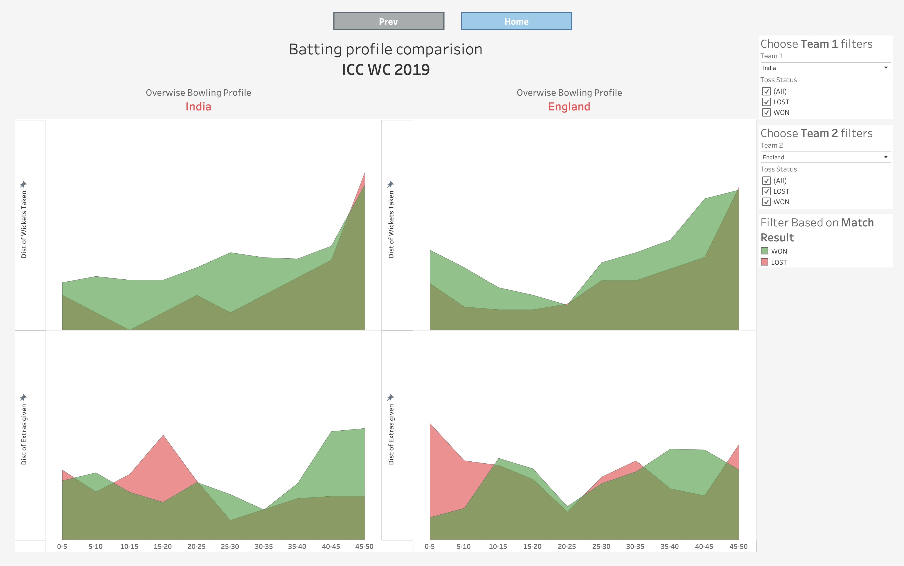

# ICC WorldCup 2019 - Data scrape & Viz
<div align="center">

[](https://public.tableau.com/views/ICCWorldCup2019_16706825856540/Page1?:language=en-US&:display_count=n&:origin=viz_share_link)
</div>

Data src: ESPN

<h1>Viz Samples</h1>
<details>
    <summary>Click me!</summary>
    






    
</details>

# Reproducing data

## Data Dump

[CSV_DATA_EXPORT](CSV_DATA_EXPORT) contains **CSV** data dump.

[SQL_DATA_EXPORT](SQL_DATA_EXPORT) contains **MySQL** data dump.

## Running from scratch

1. Install dependencies from `code/requirements.txt`
2. Make sure you have mysql installed, and create a db named `ICCWorldCup`
3. Create a file named `code/config.ini` with contents as 
```
[mysql]
host = localhost
database = ICCWorldCup
user = YOUR_DB_USER_NAME
password = YOUR_DB_PASSWORD
```
4. Run Jupyter Notebooks in following order 

    1. `1 Scrape Schedule and get JSON data from private API.ipynb`
    2. `2 manipulate data from overs and create procedures.ipynb`

## How it works
- This page of ESPN contains schedule table `https://stats.espncricinfo.com/ci/engine/records/team/match_results.html?id=12357;type=tournament`
- We first scrape that table with respective match links.
- Each of those match page gets its data from a private data API from ESPN servers.
- I have made use of two API end points. 
    - Scorecard Stats: `https://hs-consumer-api.espncricinfo.com/v1/pages/match/scorecard`
    - Over wise data `https://hs-consumer-api.espncricinfo.com/v1/pages/match/overs/details`
- Each of those API needs headers and parameters which are passed while retrieving data from `requests` module.
- The data returned is in JSON format, this data is then stored in mysql.
- We then use mysql and python to query and process data, create table and use it for visualisation.
